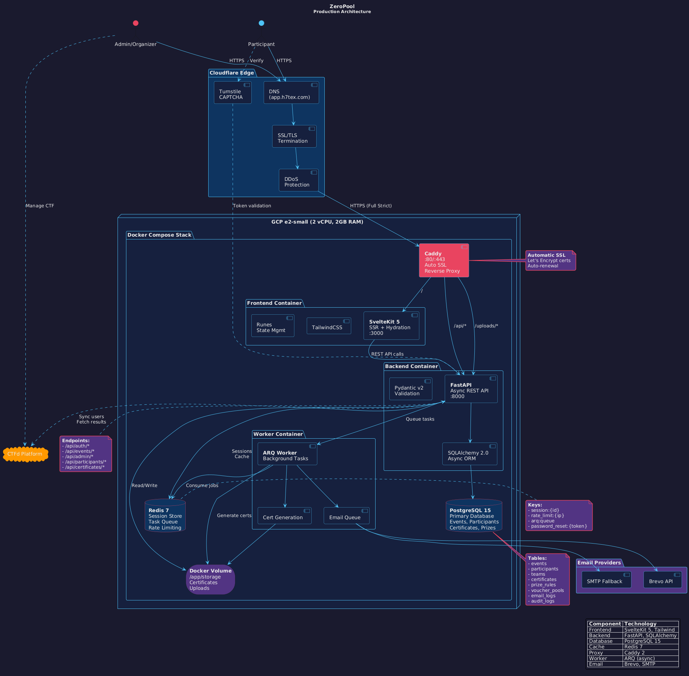

`ZeroPool`

A self-hosted platform for event organizers to handle participant registration, multi-provider email orchestration, and automated prize distribution - all without spending a dime on email services.

